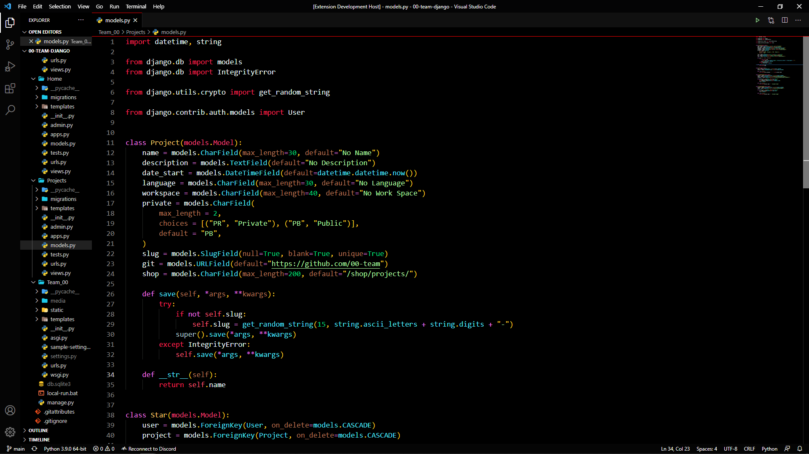

# 00 Team VS Code theme

a sample dark theme based on black and red colors

[](https://marketplace.visualstudio.com/items?itemName=i007c.00-team-theme) [](https://marketplace.visualstudio.com/items?itemName=i007c.00-team-theme) [](https://marketplace.visualstudio.com/items?itemName=i007c.00-team-theme) [](https://github.com/00-team/00-team-vscode-theme-dark)

## Install Theme

press `ctl/command + shift + p` to launch the command palette then run

```bash
ext install 00-team-theme
```

## Preview



If you like this theme checkout [00 Team Theme](https://marketplace.visualstudio.com/items?itemName=i007c.00-team-theme)

## Change log

You can take a look at the change log [here](https://github.com/00-team/00-team-vscode-theme-dark/blob/main/CHANGELOG.md)
