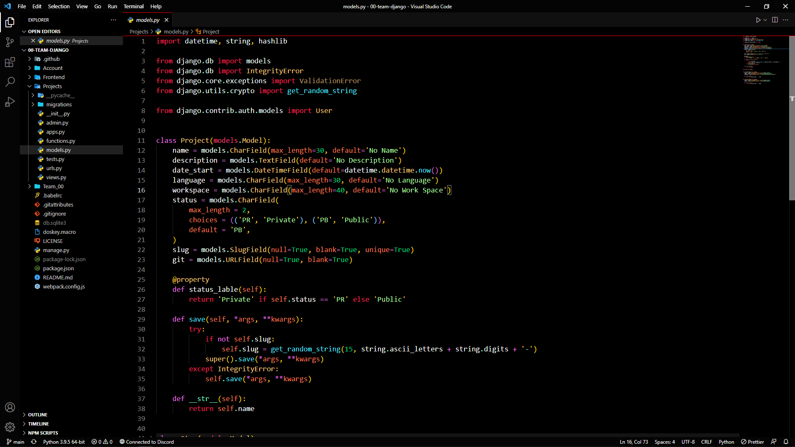

# 00 Team VS Code theme

a sample dark theme based on black and red colors

[][00 Team Theme]
[][00 Team Theme]
[][00 Team Theme]
[](https://github.com/00-team/theme)
[](https://discord.00-team.org/)

## Install Theme

press `ctl/command + shift + p` to launch the command palette then run

```bash
ext install 00-team-theme
```

## Preview



If you like this theme checkout [00 Team Theme] in vscode marketplace

## Change log

You can take a look at the change log [here](https://github.com/00-team/theme/blob/main/vscode/CHANGELOG.md)

[00 Team Theme]: https://marketplace.visualstudio.com/items?itemName=i007c.00-team-theme
